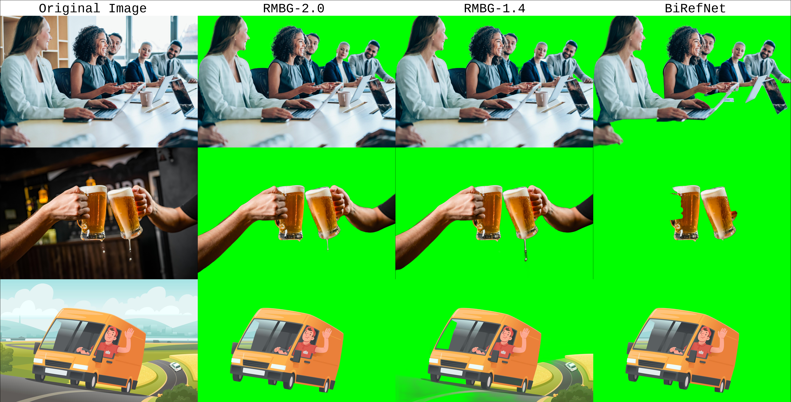

# BRIA Background Removal v2.0
<p align="center"></p>

<p align="center">
  
  
  
  
  <a href="https://huggingface.co/briaai/RMBG-2.0">
    
  </a>
  <a href="https://huggingface.co/spaces/briaai/BRIA-RMBG-2.0">
    
  </a>
</p>

RMBG v2.0 is our new state-of-the-art background removal model significantly improves RMBG v1.4. The model is designed to effectively separate foreground from background in a range of
categories and image types. This model has been trained on a carefully selected dataset, which includes:
general stock images, e-commerce, gaming, and advertising content, making it suitable for commercial use cases powering enterprise content creation at scale. 
The accuracy, efficiency, and versatility currently rival leading source-available models. 
It is ideal where content safety, legally licensed datasets, and bias mitigation are paramount. 

Developed by BRIA AI, RMBG v2.0 is available as a source-available model for non-commercial use.

### Get Access

Bria RMBG2.0 is availabe everywhere you build, either as source-code and weights, ComfyUI nodes or API endpoints.

- **Purchase:** To purchase a commercial license for RMBG V2.0 or an API package [Here](https://share-eu1.hsforms.com/2sj9FVZTGSFmFRibDLhr_ZAf4e04).
- **API Endpoint**: [Bria.ai](https://platform.bria.ai/console/api/image-editing), [fal.ai](https://fal.ai/models/fal-ai/bria/background/remove), [Replicate](https://replicate.com/bria/remove-background)
- **ComfyUI**: [Use it in workflows](https://github.com/Bria-AI/ComfyUI-BRIA-API)

For more information, please visit our [website](https://bria.ai/).

Join our [Discord community](https://discord.gg/Nxe9YW9zHS) for more information, tutorials, tools, and to connect with other users!

[CLICK HERE FOR A DEMO](https://huggingface.co/spaces/briaai/BRIA-RMBG-2.0)


## Model Details
#####
### Model Description

- **Developed by:** [BRIA AI](https://bria.ai/)
- **Model type:** Background Removal 
- **License:** [Creative Commons Attribution–Non-Commercial (CC BY-NC 4.0)](https://creativecommons.org/licenses/by-nc/4.0/deed.en)
  - The model is released under a CC BY-NC 4.0 license for non-commercial use.
  - Commercial use is subject to a commercial agreement with BRIA. Available [here](https://share-eu1.hsforms.com/2sj9FVZTGSFmFRibDLhr_ZAf4e04?utm_campaign=RMBG%202.0&utm_source=Hugging%20face&utm_medium=hyperlink&utm_content=RMBG%20Hugging%20Face%20purchase%20form)

  **Purchase:** to purchase a commercial license simply click [Here](https://go.bria.ai/3D5EGp0).

- **Model Description:** BRIA RMBG-2.0 is a dichotomous image segmentation model trained exclusively on a professional-grade dataset. The model output includes a single-channel 8-bit grayscale alpha matte, where each pixel value indicates the opacity level of the corresponding pixel in the original image. This non-binary output approach offers developers the flexibility to define custom thresholds for foreground-background separation, catering to varied use cases requirements and enhancing integration into complex pipelines.
- **BRIA:** Resources for more information: [BRIA AI](https://bria.ai/)


## Training data
Bria-RMBG model was trained with over 15,000 high-quality, high-resolution, manually labeled (pixel-wise accuracy), fully licensed images.
Our benchmark included balanced gender, balanced ethnicity, and people with different types of disabilities.
For clarity, we provide our data distribution according to different categories, demonstrating our model’s versatility.

### Distribution of images:

| Category | Distribution |
| -----------------------------------| -----------------------------------:|
| Objects only | 45.11% |
| People with objects/animals | 25.24% |
| People only | 17.35% |
| people/objects/animals with text | 8.52% |
| Text only | 2.52% |
| Animals only | 1.89% |

| Category | Distribution |
| -----------------------------------| -----------------------------------------:|
| Photorealistic | 87.70% |
| Non-Photorealistic | 12.30% |


| Category | Distribution |
| -----------------------------------| -----------------------------------:|
| Non Solid Background | 52.05% |
| Solid Background | 47.95% 


| Category | Distribution |
| -----------------------------------| -----------------------------------:|
| Single main foreground object | 51.42% |
| Multiple objects in the foreground | 48.58% |


## Qualitative Evaluation
Open source models comparison



### Architecture
RMBG-2.0 is developed on the [BiRefNet](https://github.com/ZhengPeng7/BiRefNet) architecture enhanced with our proprietary dataset and training scheme. This training data significantly improves the model’s accuracy and effectiveness for background-removal task.<br>
If you use this model in your research, please cite:

```
@article{BiRefNet,
  title={Bilateral Reference for High-Resolution Dichotomous Image Segmentation},
  author={Zheng, Peng and Gao, Dehong and Fan, Deng-Ping and Liu, Li and Laaksonen, Jorma and Ouyang, Wanli and Sebe, Nicu},
  journal={CAAI Artificial Intelligence Research},
  year={2024}
}
```

#### Requirements
```bash
torch
torchvision
pillow
kornia
transformers
```

### Usage

<!-- This section is for the model use without fine-tuning or plugging into a larger ecosystem/app. -->


```python
from PIL import Image
import matplotlib.pyplot as plt
import torch
from torchvision import transforms
from transformers import AutoModelForImageSegmentation

model = AutoModelForImageSegmentation.from_pretrained('briaai/RMBG-2.0', trust_remote_code=True)
torch.set_float32_matmul_precision(['high', 'highest'][0])
model.to('cuda')
model.eval()

# Data settings
image_size = (1024, 1024)
transform_image = transforms.Compose([
    transforms.Resize(image_size),
    transforms.ToTensor(),
    transforms.Normalize([0.485, 0.456, 0.406], [0.229, 0.224, 0.225])
])

image = Image.open(input_image_path)
input_images = transform_image(image).unsqueeze(0).to('cuda')

# Prediction
with torch.no_grad():
    preds = model(input_images)[-1].sigmoid().cpu()
pred = preds[0].squeeze()
pred_pil = transforms.ToPILImage()(pred)
mask = pred_pil.resize(image.size)
image.putalpha(mask)

image.save("no_bg_image.png")
```

## GGML CUDA and Vulkan inference

This repository includes a device-resident GGML implementation of the complete
RMBG-2.0 graph: two-scale Swin-L encoder, context/squeeze modules, decoder, deformable
ASPP, and sigmoid alpha output. Weights and intermediates remain on the selected
backend; only the input and final alpha cross the host/device boundary.

The CUDA path has a dedicated Swin-L `head_dim=32` attention node. It combines
shifted-window pack/unpack, QKV projection and split, relative-position bias, shifted
masking, softmax, output projection, and token-order restoration. Vulkan executes the
same end-to-end graph through validated GGML primitives plus exact F32 custom gathers
for input patch extraction and Swin patch merge. Attention and deformable sampling
remain primitive Vulkan graphs, so strict Vulkan does not yet match PyTorch CUDA latency.

RTX 3060 12 GiB, batch 1, 1024x1024 model input, warm steady state:

| Runtime | Mean latency | max alpha abs diff | Result |
|---|---:|---:|---|
| PyTorch CUDA FP32 | 705.45 ms | reference | baseline |
| GGML CUDA fast | **592.29 ms** | 1.315e-3 | **1.19x faster** |
| GGML CUDA strict FP32 | 763.56 ms | 1.122e-4 | strict parity |
| GGML Vulkan FP32 | 1293.35 ms | 1.081e-4 | portable fallback |

CUDA fast mode is the default: it selects TF32 Tensor Core GEMMs while retaining FP32
accumulation. No alpha pixels exceed `2e-3` absolute error in the parity fixture. Set
`RMBG_STRICT_MATH=1` when strict FP32 GEMM reproducibility is more important than
throughput. The current comparison uses PyTorch 2.7.1+cu118 with TF32 disabled and 12
warm steady-state iterations. Benchmark metadata is in
[`docs/rmbg_benchmark.json`](docs/rmbg_benchmark.json).


Build and run CUDA:

```bash
cmake -S . -B build-cuda -DRMBG_GGML_CUDA=ON -DRMBG_BUILD_TESTS=ON
cmake --build build-cuda -j
./build-cuda/rmbg-cli remove \
  --model models/rmbg_f16.gguf \
  --input input.png --output output.png --device cuda
```

Reproduce a benchmark and regenerate the figures:

```bash
python scripts/benchmark_full.py --input t4.png --gguf models/rmbg_f16.gguf \
  --backend cuda --build-dir build-cuda --pytorch-device cuda --math fast --runs 5
python scripts/plot_benchmarks.py
```

See [`docs/PORTING.md`](docs/PORTING.md) for graph ownership, backend fallbacks,
strict-math flags, and parity details.
See [`models/README.md`](models/README.md) for the distinction between deployable
models, compatibility split weights, and unit-test subsets.
The local Vulkan investigation and the resulting operator plan are in
[`docs/VULKAN_RESEARCH.md`](docs/VULKAN_RESEARCH.md).

### GGUF Precision Variants

The `models/` directory contains complete, runtime-named GGUF files for the full graph:

| Model | Size | CUDA strict mean | Vulkan strict mean | max alpha abs diff |
|---|---:|---:|---:|---:|
| `rmbg_f32.gguf` | 841.9 MiB | 644.53 ms | 1293.35 ms | 1.122e-4 |
| `rmbg_f16.gguf` | 421.0 MiB | 655.18 ms | 1278.46 ms | 1.122e-4 |

Both entries are batch 1, 1024x1024, five warm steady-state iterations on RTX 3060.
F16 is the deployment default. Q8 has been removed from the RMBG release: its only
parity-safe hybrid version saved 16.9 MiB relative to F16 but measured 648.72 ms CUDA /
1278.50 ms Vulkan, so it was not faster on either backend. Full Q8 quantization also
exceeded the `2e-3` alpha gate.

Regenerate the variants from the validated split weights:

```bash
python scripts/quantize_rmbg_gguf.py \
  --input models/development/encoder_f16.gguf models/development/decoder_alpha_f16.gguf \
  --out models/rmbg_f32.gguf --format f32
python scripts/quantize_rmbg_gguf.py \
  --input models/development/encoder_f16.gguf models/development/decoder_alpha_f16.gguf \
  --out models/rmbg_f16.gguf --format f16
```

Vulkan defaults to strict FP32 math. Set `RMBG_VULKAN_FAST=1` only when a measured
`~5e-3` alpha difference is acceptable; on this RTX 3060 it reduces F32 latency to about
887 ms, but does not meet the repository's strict `2e-3` gate.
