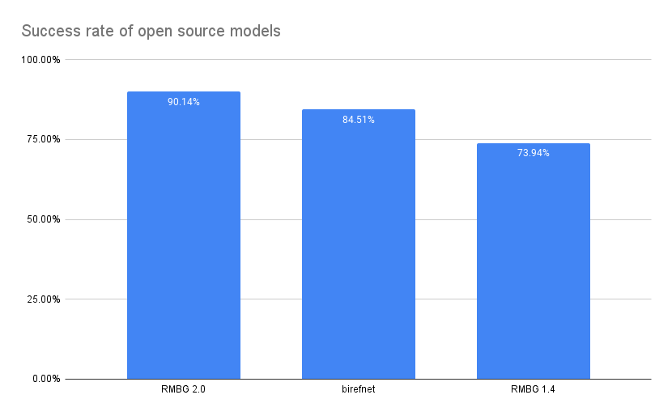
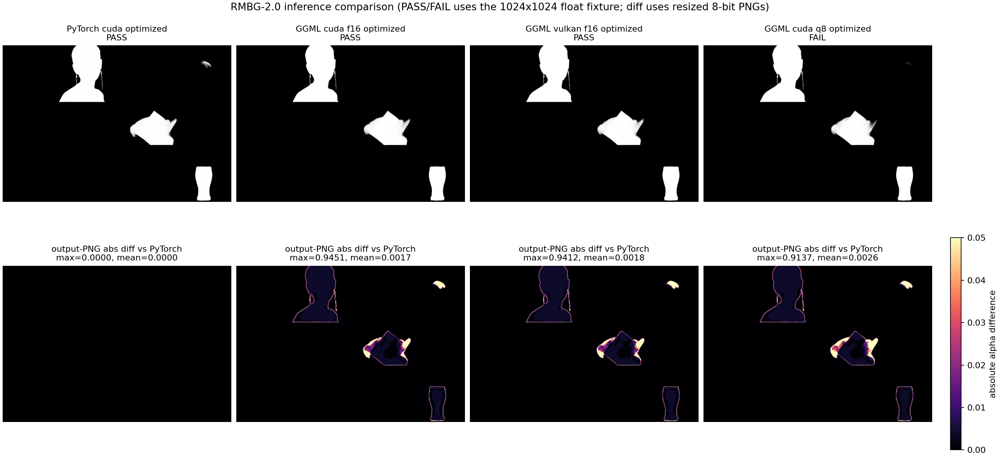
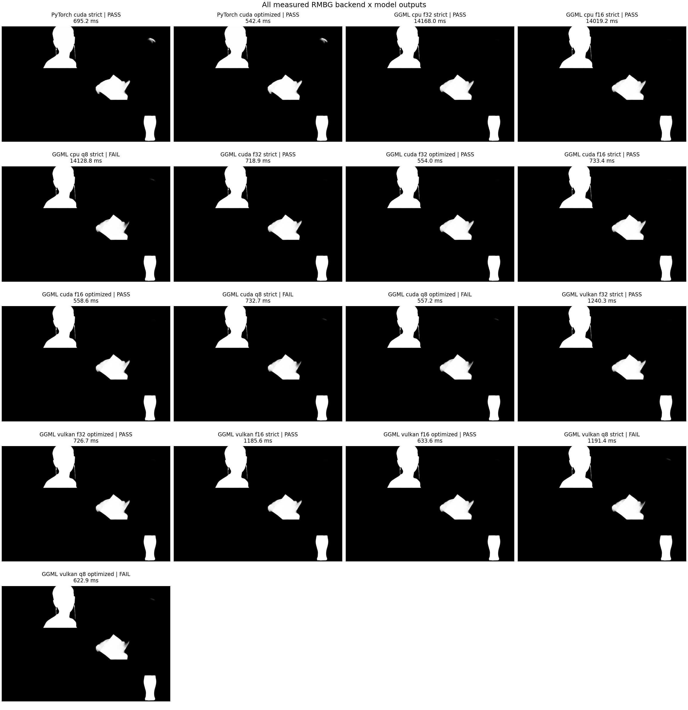
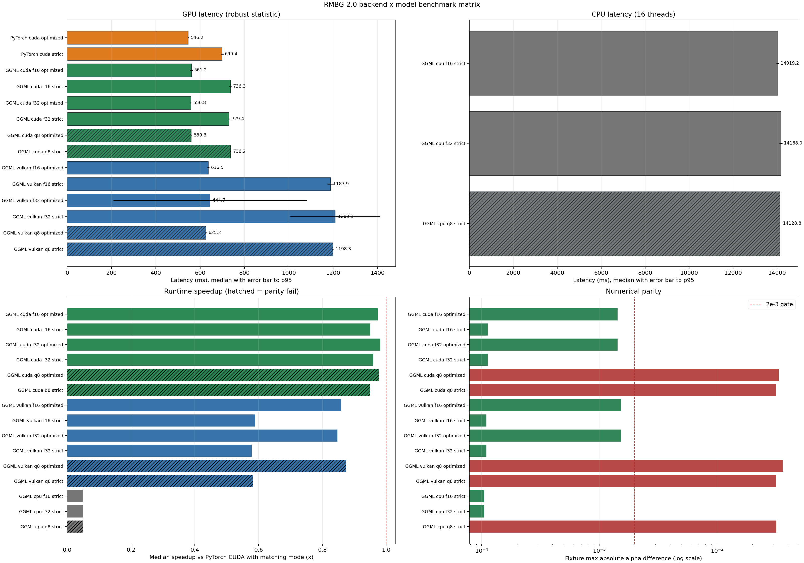

# BRIA Background Removal v2.0
<p align="center"></p>

<p align="center">
  
  
  
  
  <a href="https://huggingface.co/briaai/RMBG-2.0">
    
  </a>
  <a href="https://huggingface.co/spaces/briaai/BRIA-RMBG-2.0">
    
  </a>
</p>

RMBG v2.0 is our new state-of-the-art background removal model significantly improves RMBG v1.4. The model is designed to effectively separate foreground from background in a range of
categories and image types. This model has been trained on a carefully selected dataset, which includes:
general stock images, e-commerce, gaming, and advertising content, making it suitable for commercial use cases powering enterprise content creation at scale. 
The accuracy, efficiency, and versatility currently rival leading source-available models. 
It is ideal where content safety, legally licensed datasets, and bias mitigation are paramount. 

Developed by BRIA AI, RMBG v2.0 is available as a source-available model for non-commercial use.

### Get Access

Bria RMBG2.0 is availabe everywhere you build, either as source-code and weights, ComfyUI nodes or API endpoints.

- **Purchase:** To purchase a commercial license for RMBG V2.0 or an API package [Here](https://share-eu1.hsforms.com/2sj9FVZTGSFmFRibDLhr_ZAf4e04).
- **API Endpoint**: [Bria.ai](https://platform.bria.ai/console/api/image-editing), [fal.ai](https://fal.ai/models/fal-ai/bria/background/remove), [Replicate](https://replicate.com/bria/remove-background)
- **ComfyUI**: [Use it in workflows](https://github.com/Bria-AI/ComfyUI-BRIA-API)

For more information, please visit our [website](https://bria.ai/).

Join our [Discord community](https://discord.gg/Nxe9YW9zHS) for more information, tutorials, tools, and to connect with other users!

[CLICK HERE FOR A DEMO](https://huggingface.co/spaces/briaai/BRIA-RMBG-2.0)


## Model Details
#####
### Model Description

- **Developed by:** [BRIA AI](https://bria.ai/)
- **Model type:** Background Removal 
- **License:** [Creative Commons Attribution–Non-Commercial (CC BY-NC 4.0)](https://creativecommons.org/licenses/by-nc/4.0/deed.en)
  - The model is released under a CC BY-NC 4.0 license for non-commercial use.
  - Commercial use is subject to a commercial agreement with BRIA. Available [here](https://share-eu1.hsforms.com/2sj9FVZTGSFmFRibDLhr_ZAf4e04?utm_campaign=RMBG%202.0&utm_source=Hugging%20face&utm_medium=hyperlink&utm_content=RMBG%20Hugging%20Face%20purchase%20form)

  **Purchase:** to purchase a commercial license simply click [Here](https://go.bria.ai/3D5EGp0).

- **Model Description:** BRIA RMBG-2.0 is a dichotomous image segmentation model trained exclusively on a professional-grade dataset. The model output includes a single-channel 8-bit grayscale alpha matte, where each pixel value indicates the opacity level of the corresponding pixel in the original image. This non-binary output approach offers developers the flexibility to define custom thresholds for foreground-background separation, catering to varied use cases requirements and enhancing integration into complex pipelines.
- **BRIA:** Resources for more information: [BRIA AI](https://bria.ai/)


## Training data
Bria-RMBG model was trained with over 15,000 high-quality, high-resolution, manually labeled (pixel-wise accuracy), fully licensed images.
Our benchmark included balanced gender, balanced ethnicity, and people with different types of disabilities.
For clarity, we provide our data distribution according to different categories, demonstrating our model’s versatility.

### Distribution of images:

| Category | Distribution |
| -----------------------------------| -----------------------------------:|
| Objects only | 45.11% |
| People with objects/animals | 25.24% |
| People only | 17.35% |
| people/objects/animals with text | 8.52% |
| Text only | 2.52% |
| Animals only | 1.89% |

| Category | Distribution |
| -----------------------------------| -----------------------------------------:|
| Photorealistic | 87.70% |
| Non-Photorealistic | 12.30% |


| Category | Distribution |
| -----------------------------------| -----------------------------------:|
| Non Solid Background | 52.05% |
| Solid Background | 47.95% 


| Category | Distribution |
| -----------------------------------| -----------------------------------:|
| Single main foreground object | 51.42% |
| Multiple objects in the foreground | 48.58% |


## Qualitative Evaluation
Open source models comparison



### Architecture
RMBG-2.0 is developed on the [BiRefNet](https://github.com/ZhengPeng7/BiRefNet) architecture enhanced with our proprietary dataset and training scheme. This training data significantly improves the model’s accuracy and effectiveness for background-removal task.<br>
If you use this model in your research, please cite:

```
@article{BiRefNet,
  title={Bilateral Reference for High-Resolution Dichotomous Image Segmentation},
  author={Zheng, Peng and Gao, Dehong and Fan, Deng-Ping and Liu, Li and Laaksonen, Jorma and Ouyang, Wanli and Sebe, Nicu},
  journal={CAAI Artificial Intelligence Research},
  year={2024}
}
```

#### Requirements
```bash
torch
torchvision
pillow
kornia
transformers
```

### Usage

<!-- This section is for the model use without fine-tuning or plugging into a larger ecosystem/app. -->


```python
from PIL import Image
import matplotlib.pyplot as plt
import torch
from torchvision import transforms
from transformers import AutoModelForImageSegmentation

model = AutoModelForImageSegmentation.from_pretrained('briaai/RMBG-2.0', trust_remote_code=True)
torch.set_float32_matmul_precision(['high', 'highest'][0])
model.to('cuda')
model.eval()

# Data settings
image_size = (1024, 1024)
transform_image = transforms.Compose([
    transforms.Resize(image_size),
    transforms.ToTensor(),
    transforms.Normalize([0.485, 0.456, 0.406], [0.229, 0.224, 0.225])
])

image = Image.open(input_image_path)
input_images = transform_image(image).unsqueeze(0).to('cuda')

# Prediction
with torch.no_grad():
    preds = model(input_images)[-1].sigmoid().cpu()
pred = preds[0].squeeze()
pred_pil = transforms.ToPILImage()(pred)
mask = pred_pil.resize(image.size)
image.putalpha(mask)

image.save("no_bg_image.png")
```

## GGML CUDA and Vulkan inference

This repository includes a device-resident GGML implementation of the complete
RMBG-2.0 graph: two-scale Swin-L encoder, context/squeeze modules, decoder, deformable
ASPP, and sigmoid alpha output. Weights and intermediates remain on the selected
backend; only the input and final alpha cross the host/device boundary.

The CUDA path includes dedicated Swin-L and deformable-im2col nodes, optional cuDNN
convolution, and cached cuDNN descriptors/algorithm selection. Vulkan includes exact
F32 gather/layout shaders, fused channel-affine operations, direct convolution with
scalar accumulation, and a per-node CM1 whitelist; attention and deformable sampling
retain strict primitive fallbacks where the fast path fails the fixture gate.

Current measured matrix: RTX 3060 12 GiB, batch 1, 1024x1024, PyTorch 2.6.0+cu118,
seven timed GPU iterations after two warmups. The report records raw samples, median, and
P95. `strict` is compared with PyTorch strict; `optimized` is compared with PyTorch's
matching non-strict mode; `unsafe-fast` is diagnostic only.

| Runtime / model | Median | P95 | max fixture diff | Versus matching PyTorch mode | Result |
|---|---:|---:|---:|---:|---|
| PyTorch CUDA strict FP32 | 722.23 ms | 726.66 ms | reference | 1.000x | baseline |
| PyTorch CUDA optimized FP32 | 559.96 ms | 564.92 ms | reference | 1.000x | baseline |
| GGML CUDA F32 optimized | 573.12 ms | 575.18 ms | 1.430e-3 | 0.977x | pass |
| GGML CUDA F16 optimized | **570.17 ms** | 573.26 ms | 1.430e-3 | 0.982x | pass |
| GGML CUDA F32 strict | 745.90 ms | 750.30 ms | 1.131e-4 | 0.968x | pass |
| GGML CUDA F16 strict | 748.71 ms | 754.54 ms | 1.131e-4 | 0.965x | pass |
| GGML Vulkan F32 optimized | 682.32 ms | 684.41 ms | 1.533e-3 | 0.821x | pass, 1.058x vs PyTorch strict |
| GGML Vulkan F16 optimized | **675.88 ms** | 692.86 ms | 1.533e-3 | 0.828x | pass, 1.069x vs PyTorch strict |
| GGML Vulkan F32 strict | 1259.02 ms | 1267.05 ms | 1.099e-4 | 0.574x | pass, diagnostic baseline |
| GGML Vulkan F16 strict | 1256.48 ms | 1259.14 ms | 1.099e-4 | 0.575x | pass, diagnostic baseline |
| GGML CPU F16 strict, 16 threads | 15201.65 ms | 15281.42 ms | 1.052e-4 | 0.048x | pass |

CUDA and Vulkan optimized modes are the production defaults and pass the repository's
`2e-3` fixture gate. Strict is a slower arithmetic/reference profile for parity and
regression diagnosis, not a quality mode; use it only with `RMBG_STRICT_MATH=1` or
`RMBG_VULKAN_MODE=strict` when validating numerical changes. Vulkan optimized uses
direct scalar convolution and CM1 only for the four encoder stages and validated decoder
projections. `RMBG_VULKAN_MODE=unsafe-fast` (or legacy `RMBG_VULKAN_FAST=1`) is a
parity-failing experiment. The benchmark uses the open
`ZhengPeng7/BiRefNet` weights used by the checked fixtures; the exact model/input hashes,
raw samples, p95, environment, and per-case pass/fail state are in
[`docs/rmbg_benchmark.json`](docs/rmbg_benchmark.json).







The comparison figure's PASS/FAIL label uses the raw 1024x1024 float fixture gate. Its
heatmap compares final original-size 8-bit PNG alpha channels, so isolated edge pixels
can have a much larger maximum after resize and quantization; the mean remains the useful
visual-output summary.

Build and run CUDA:

```bash
cmake -S . -B build-cuda -DRMBG_GGML_CUDA=ON -DRMBG_BUILD_TESTS=ON
cmake --build build-cuda -j
./build-cuda/rmbg-cli remove \
  --model models/rmbg_f16.gguf \
  --input input.png --output output.png --device cuda
```

Reproduce a benchmark and regenerate the figures:

```bash
python scripts/benchmark_full.py --input docs/images/t4.png \
  --pytorch-model ZhengPeng7/BiRefNet --math-modes strict optimized \
  --runs 7 --warmup 2 \
  --cpu-runs 2 --cpu-warmup 0 --cpu-threads 16 --local-files-only
python scripts/plot_benchmarks.py
```

By default the runner detects `rmbg_f32.gguf`, `rmbg_f16.gguf`, and
`rmbg_q8.gguf`, then measures the production `optimized` GPU mode plus the CPU
reference. Pass `--math-modes strict optimized` for the complete diagnostic matrix;
use repeated `--model NAME=PATH` arguments to benchmark a different model set.

See [`docs/PORTING.md`](docs/PORTING.md) for graph ownership, backend fallbacks,
strict-math flags, and parity details.
See [`models/README.md`](models/README.md) for the distinction between deployable
models, compatibility split weights, and unit-test subsets.
The local Vulkan investigation and the resulting operator plan are in
[`docs/VULKAN_RESEARCH.md`](docs/VULKAN_RESEARCH.md).

### GGUF assets

The `models/` directory contains complete, runtime-named GGUF files for the full graph:

| Model | Size | Status |
|---|---:|---|
| `rmbg_f32.gguf` | 841.9 MiB | Numerical reference and diagnostic model |
| `rmbg_f16.gguf` | 421.0 MiB | Production default |
| `rmbg_q8.gguf` | 247.0 MiB | Experimental benchmark artifact; parity failure |

Q8 is measured for completeness but is not a supported deployment format: every
backend exceeds the `2e-3` alpha gate. Exact latency and error values remain in the
single performance table above and in `docs/rmbg_benchmark.json`.

Regenerate the variants from the validated split weights:

```bash
python scripts/quantize_rmbg_gguf.py \
  --input models/development/encoder_f16.gguf models/development/decoder_alpha_f16.gguf \
  --out models/rmbg_f32.gguf --format f32 --model-id ZhengPeng7/BiRefNet
python scripts/quantize_rmbg_gguf.py \
  --input models/development/encoder_f16.gguf models/development/decoder_alpha_f16.gguf \
  --out models/rmbg_f16.gguf --format f16 --model-id ZhengPeng7/BiRefNet
```

### Patched ggml integration

All repository-specific ggml changes live in `third_party/ggml-rmbg.patch`. CMake reads
the pinned submodule commit and patch SHA-256, exports that commit into a content-addressed
build-tree source directory, applies and reverse-verifies the patch, and only then calls
`add_subdirectory`. Editing the patch is a configure dependency, so developers never
need to modify or manually patch the submodule.

```bash
git submodule update --init --recursive third_party/ggml
cmake -S . -B build-cuda -DRMBG_GGML_CUDA=ON
```

The built ggml version contains both identities, for example
`06ca97616793+rmbg.1e707fee4c86`. A patch that does not apply to the pinned commit makes
configuration fail instead of silently building unpatched ggml.

### Repository-local Git identity

Configure this clone without changing global Git settings:

```bash
git config --local user.name ludahai
git config --local user.email ludahai19@163.com
git config --local --get user.name
git config --local --get user.email
```
